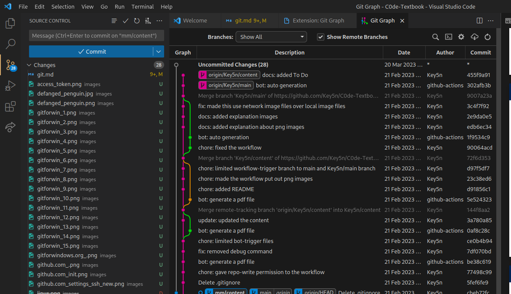

<!-- _class: lead -->

# Git 入門

## 環境構築編


<!-- footer :  名古屋工業大学プログラミング部 C0de -->

---

<!-- _header: このスライドの目的 -->

- 開発・作業で Git を使うための環境を構築するための説明
- **Windows での構築（含 WSL）がターゲット**
  - Macintosh ならHomebrew で Git を入れると良さそう
  - Linux なら一般的には適当なパッケージマネージャで入れるだけ

- そもそも Git を利用したホスティングサービスは複数存在
  - GitHub
  - GitLab
  - Bitbucket &nbsp;&nbsp;&nbsp;&nbsp;&nbsp;&nbsp; etc ...
  - （余談）Onedrive や Google Drive にも構築できる
- 今回は **GitHub の利用に絞って説明**

---

<!-- _class: lead -->

# GitHubへの登録

---

<!-- _class: image-one -->

<!-- _header: GitHubへの登録 -->


- ユーザ登録
  - GitHub のホームページ([https://github.com/](https://github.com/))から「**Sign Up**」をクリックして登録。
    - 流れに沿って登録すれば良い
    - 基本的に英語 only だが、そう難しくはない
    - **username** はあとから変更もできるが、かなり面倒くさいことになり得るので、後悔しない名前をびしっと決めておくことを推奨
    - 途中で料金プランについて聞かれるが、**free（無料）プラン**で十分
      - 今後 **pro（有料）プラン**を使いたくなったら、学生証の写真をアップロードすると無料になるのでお得かも

---

<!-- _class: image-one -->

<!-- _header: GitHubへの登録 -->

- 登録完了
  - 伝説はここから始まる


---

<!-- _class: lead -->

# Git を使える環境の導入

---

<!-- _header: Gitの導入手順 -->

- WindowsでのGitの導入を紹介

  - 今回は

    1. **Windows ネイティブ**に入れる
    1. **Windows Subsystem for Linux (WSL)** に入れる

    以上 2 パターンの両方について扱う

---

<!-- _class: image-one -->

<!-- _header: Windows ネイティブへの導入 -->

- 「**Git for Windows**」を紹介


  - CUI & GUI で Git を扱える

  - 公式サイト ([https://gitforwindows.org](https://gitforwindows.org))からダウンロードしてインストール
  - 次のページからインストール手順の一例を紹介
    - あくまで一例
    - 今回はスライド作成時点で最新のバージョン **v2.40.0** を使用
    - バージョンごとに細かな箇所が変わるので注意

---

<!-- _header: Windows ネイティブへの導入 -->

<table>
  <tr>
    <td><ol><li value="1">規約に同意する</li></ol></td>
    <td class="image"></td>
  </tr>
  <tr>
    <td><ol><li value="2">インストール先の選択<ul><li>デフォルトのままでOK</li></ul></li></ol></td>
    <td class="image"></td>
  </tr>
</table>

---

<!-- _header: Windows ネイティブへの導入 -->

<table>
  <tr>
    <td><ol><li value="3">コンポーネントの選択<ul><li><ul><li>「Git Bash Here」</li><li>「Git GUI Here」</li></ul>にチェックを入れることを推奨</li></ul></li></ol></td>
    <td class="image"></td>
  </tr>
  <tr>
    <td><ol><li value="4">スタートメニューの設定<ul><li>デフォルトのままでOK</li></ul></li></ol></td>
    <td class="image"></td>
  </tr>
</table>

---

<!-- _header: Windows ネイティブへの導入 -->

<table>
  <tr>
    <td><ol><li value="5">テキストエディタの選択<ul><li>コミット時などに使うエディタの選択</li><ul><li>「Vim」 または 「Visual Studio Code」を推奨</li></ul></ul></li></ol></td>
    <td class="image"></td>
  </tr>
  <tr>
    <td><ol><li value="6">新規リポジトリの既定ブランチ名の設定<ul><li>GitHubの流儀に従うことを考えて、「Override」にチェックし、「<strong>main</strong>」と入力</li></ul></li></ol></td>
    <td class="image"></td>
  </tr>
</table>

---

<!-- _header: Windows ネイティブへの導入 -->

<table>
  <tr>
    <td><ol><li value="7">Gitの環境変数の設定<ul><li>デフォルトの「……also from 3rd-party software」にチェック</li></ul></li></ol></td>
    <td class="image"></td>
  </tr>
  <tr>
    <td><ol><li value="8">使用するSSHバイナリの選択<ul><li>デフォルトの「Use bundled OpenSSH」にチェック</li></ul></li></ol></td>
    <td class="image"></td>
  </tr>
</table>

---

<!-- _header: Windows ネイティブへの導入 -->

<table>
  <tr>
    <td><ol><li value="9">HTTPS接続時のライブラリ選択<ul><li>デフォルトの「Use the OpenSSL library」にチェック</li></ul></li></ol></td>
    <td class="image"></td>
  </tr>
  <tr>
    <td><ol><li value="10">改行コードの扱いの設定<ul><li>デフォルトの「Checkout Windows style,……」にチェック<ul><li>CRLF を使う Windows くんに忖度<s>ほんまｋｓ</s></li></ul></li></ul></li></ol></td>
    <td class="image"></td>
  </tr>
</table>

---

<!-- _header: Windows ネイティブへの導入 -->

<table>
  <tr>
    <td><ol><li value="11">使用するターミナルの設定<ul><li>デフォルトの「Use MinTTY」にチェック</li></ul></li></ol></td>
    <td class="image"></td>
  </tr>
  <tr>
    <td><ol><li value="12">git pull の挙動の設定<ul><li>デフォルトの「Default」にチェック</li></ul></li></ol></td>
    <td class="image"></td>
  </tr>
</table>

---

<!-- _header: Windows ネイティブへの導入 -->

<table>
  <tr>
    <td><ol><li value="13">GCMの設定<ul><li>デフォルトの「Use Credential Manager」にチェック</li></ul></li></ol></td>
    <td class="image"></td>
  </tr>
  <tr>
    <td><ol><li value="14">その他の設定<ul><li>デフォルトのまま「Enable file system caching」のみにチェック</li></ul></li></ol></td>
    <td class="image"></td>
  </tr>
</table>

---

<!-- _header: Windows ネイティブへの導入 -->

<table>
  <tr>
    <td><ol><li value="15">実験的機能の設定<ul><li>デフォルトのまま特にチェックしなくて良い</li></ul></li></ol></td>
    <td class="image"></td>
  </tr>
    <tr>
    <td><ol><li value="16">Done!<ul>
  </tr>
</table>

---

<!-- _class: image-one -->

<!-- _header: WSL への導入 -->

- WSL 上の Ubuntu に Git を導入

  - WSL の導入から説明
    - やり方がわかる人やすでに WSL を導入済みの人はスキップすれば良い

  - もちろんこだわりがあるのなら Ubuntu でなくても良い

  - ほぼコマンドライン上の操作のみで完結
    - 「Git for Win」に比べればむしろ簡潔かも（激ウマギャグ）

  - 以降 Windows 10 の バージョン 21H2 以降、または Windows 11 を対象
    - それ以前でもできる場合があるが手順が異なる（ｇｇｒ）
    - バージョンは「スタートボタンを右クリック→『システム』」で確認可能

---

<!-- _header: WSL への導入 -->

- WSL をインストール
  <ol><li value="1">PowerShellを管理者として実行</li><ul><li>スタートボタンの右クリックメニューから呼び出せる</li></ul></ol>
  <ol><li value="2">下記コマンドを実行</li></ol>

    ```bash
    wsl --install
    ```

  <ol><li value="3">システムの再起動を要求されるので従う</li></ol>

---

<!-- _class: image-one -->

<!-- _header: WSL への導入 -->

  <ol><li value="4">Ubuntu のターミナルに <strong>username</strong> と <strong>password</strong> を入力</li><ul><li>好きに決めて良い</li></ul><ul><li>Windows のものと一致させる必要はない</li></ul></ol>
  <ol><li value="5">プリインストールされたパッケージを更新</li><ul><li>下記コマンドを順に実行</li><ul><li><strong>update</strong> で更新があるか確認</li><li><strong>upgrade</strong> で実際に更新</li></ul></ul></ol>

  ```bash
  sudo apt update
  sudo apt upgrade
  ```

---

<!-- _header: WSL への導入 -->

- WSL をインストール（続き）
  <ol><li value="6">Git はプリインストールされているはずなので確認</li></ol>

    ```bash
    git --version
    ```

    `git version 2.34.1`のようにバージョンが出力されればOK

  7. Ubuntu 上のファイルは、Windows のエクスプローラのアドレスに`\\wsl$`と入力することで参照できる

---

<!-- _header: WSL への導入 -->

- WSL をインストール（続き）
  <ol><li value="8">（オプション）「build-essential」パッケージを入れておくと良い</li><ul><li>gcc や make などパッケージの構築に必須級のパッケージがまとめて入る</li></ul></ol>

    ```bash
    sudo apt install build-essential
    ```

    <ol><li value="9">（オプション）義務</li></ol>

    ```bash
    sudo apt install emacs
    ```

---

<!-- _header: WSL への導入 -->

- WSL をインストール（続き）
  <ol><li value="10">（余談）この方法でインストールした WSL（ストア版）は最初からGUIが使える</li></ol>

  

  - 以前のバージョンは自分でXサーバをインストールする必要があったんじゃ（語り部の老人）

---

<!-- _class: lead -->

# Git の設定

---

<!-- _class: image-one -->

<!-- _header: Git の設定 -->

- GitHub へのアクセス権の設定
  - 手段は2つ
    - アクセストークンの利用
    - SSH 接続の利用
    - （過去にはアカウントのパスワードでも利用できたが2021年の8月に廃止）

---

<!-- _class: image-one -->

<!-- _header: アクセストークンの利用 -->


1. GitHubのページから自分のアカウントの「Setting」へ移動
1. 「Developer settings」へ移動
1. 「Personal access tokens」の「Fine-grained personal tokens」へ移動
1. 「Generate new token」をクリック
1. 「Token name」と「Expiration」（有効期限）を適当に設定
1. 「Repository access」は「All repositories」にチェック

---

<!-- _header: アクセストークンの利用 -->

7. 「Permissions」内の「Contents」のアクセス権を「Read and write」に変更
8. ページ下部の「Generate token」をクリック
9. 英数字記号からなるトークンが表示される

- :warning: 注意
  - アクセストークンが表示されたページを閉じると、**二度と同じものを表示することはできない**
  - トークンのアクセス権の範囲はあとからでも変更可能
  - トークンは push 時などに（原則）毎回尋ねられることに注意

---

<!-- _header: SSH 接続の利用 -->

1. Windows ネイティブ環境の場合は Git Bash を、WSL 環境の場合はそのターミナルを開く
2. SSH鍵を作成する。以下のコマンドを実行

```bash
ssh-keygen -t ed25519 -C "GitHubの登録に用いたメールアドレス"
```

- `-C` は SSH 鍵につけるコメントの指定
  - 無指定だと「**username@hostname**」になる
- `-t` は 使用する暗号化方式の指定
  - 楕円曲線暗号である「ed25519」の使用を推奨
  - 巷のチュートリアルでは（デフォルトの）「RSA 3072」や（デフォルトだった）「RSA 2048」がまだ多いかな？

---

<!-- _header: SSH 接続の利用 -->

3. 対話に答えながら鍵を作成

- 鍵の保存場所、パスフレーズの入力、パスフレーズの再入力、という順番で入力を求められるが、すべてデフォルトで良い（Enter 連打）

```
Generating public/private ed25519 key pair.
Enter file in which to save the key (/home/(ユーザ名)/.ssh/id_ed25519):
Enter passphrase (empty for no passphrase):
Enter same passphrase again:
Your identification has been saved in id_ed25519
Your public key has been saved in id_ed25519.pub
The key fingerprint is:
SHA256:e9rsKl(省略) (メールアドレス)
The key's randomart image is:
+--[ED25519 256]--+
|   .. (省略) ..   |
+----[SHA256]-----+
```

---

<!-- _header: SSH 接続の利用 -->

4. 鍵の生成を確認

- `~/.ssh/` に `id_ed25519` と `id_ed25519.pub` の2ファイルが生成されていることを確認
- `id_ed25519` は秘密鍵。**絶対に他人に漏らさない**
- `id_ed25519.pub` は公開鍵。これを GitHub に登録して認証する

---

<!-- _header: SSH 接続の利用 -->

5. 公開鍵を準備

- 以下のコマンドを実行

```bash
cat ~/.ssh/id_ed25519.pub | clip.exe
```

- 公開鍵の内容（文字列）がクリップボードに転送される  
（"Ctrl-V" で貼り付けられる状態）

---

<!-- _header: SSH 接続の利用 -->

6. 公開鍵を登録

- GitHub のページの右上にある自分のアイコンをクリック→「Settings」へ移動
- 「SSH and GPG keys」へ移動
- 緑色の「New SSH key」をクリック

---

<!-- _class: image-one -->

<!-- _header: SSH 接続の利用 -->

6. 公開鍵を登録（続き）


- 「Title」には適当な文字列を入力
  - SSH 鍵を生成した PC を識別できる名前がおすすめ
- 「Key type」は Authentication Key
- 「Key」には先程クリップボードに仕込んだ公開鍵の内容を貼り付ける
- 「Add SSH key」をクリック

---

<!-- _header: SSH 接続の利用 -->

7. ローカル環境のGitHub アカウントとの紐付け

- 以下の2つのコマンドを実行

```bash
git config --global user.name "GitHubでの自分のusername"
git config --global user.email "GitHubの登録に用いたメールアドレス"
```

- この内容は `~/.gitconfig` に保存される

---

<!-- _header: SSH 接続の利用 -->

8. 疎通確認

- 以下のコマンドを実行

```bash
ssh -T git@github.com
```

- もし以下のような警告が出たら（fingerprint を確かめて$^{[1]}$） `yes`

```
The authenticity of host 'github.com (IP ADDRESS)' can't be established.
RSA key fingerprint is SHA256:nThbg6kXUpJWGl7E1IGOCspRomTxdCARLviKw6E5SY8.
Are you sure you want to continue connecting (yes/no)?
```

>[1] ここで最新の fingerprint を確認できる: [https://docs.github.com/ja/authentication/keeping-your-account-and-data-secure/githubs-ssh-key-fingerprints](https://docs.github.com/ja/authentication/keeping-your-account-and-data-secure/githubs-ssh-key-fingerprints)

---

<!-- _header: SSH 接続の利用 -->

9. 成功メッセージが帰ってきたら成功

```
Hi (GitHubでの自分のusername)! You've successfully authenticated, but GitHub does not
provide shell access.
```

---

<!-- _class: lead -->

# Git の周辺ツール

---

<!-- _class: image-one -->

<!-- _header: Git の周辺ツール -->


- **その1「GitHub Desktop」**

  - Windows と Macintosh で使用可能
  - GitHub 公式謹製
  - とってもグラフィカル、ほぼマウスで完結
  - GitHub の独自機能の部分も手厚い対応
  - [https://desktop.github.com](https://desktop.github.com)

---

<!-- _class: image-one -->

<!-- _header: Git の周辺ツール -->


- **その2「Sourcetree」**

  - マルチプラットフォーム対応（Linux も）
  - GitHub に限らず対応
  - 日本語化も可能
  - Git GUI 操作の定番
  - [https://www.sourcetreeapp.com](https://www.sourcetreeapp.com)

---

<!-- _class: image-one -->

<!-- _header: Git の周辺ツール -->



- **その3「VSCode」**

  - エディタ自体は説明不要
  - コミットやブランチ操作など基本的なことは素でできる
  - 拡張機能でさらに強化可能
    - 「Git Lens」 - 差分の表示やコミット履歴の確認などが強化されるユーティリティツール
    - 「Git Graph」 - コミット履歴を見やすいツリー状に表示する拡張機能
    - 「Git History」 - コミットメッセージの検索やファイル単位・行単位の履歴確認を強化する拡張機能

---

<!-- _class: image-one -->

<!-- _header: Git の周辺ツール -->


- **その4「Magit」**

  - Emacs のパッケージ（拡張機能）
  - 最初は扱いにくい（断言）
  - 慣れるとあらゆる操作がコマンドラインを凌駕する速度になる
  - 「ファイルの一部のみ unstage」や「コンフリクト解消」のような込み入った操作もすべてキーボードで完結
